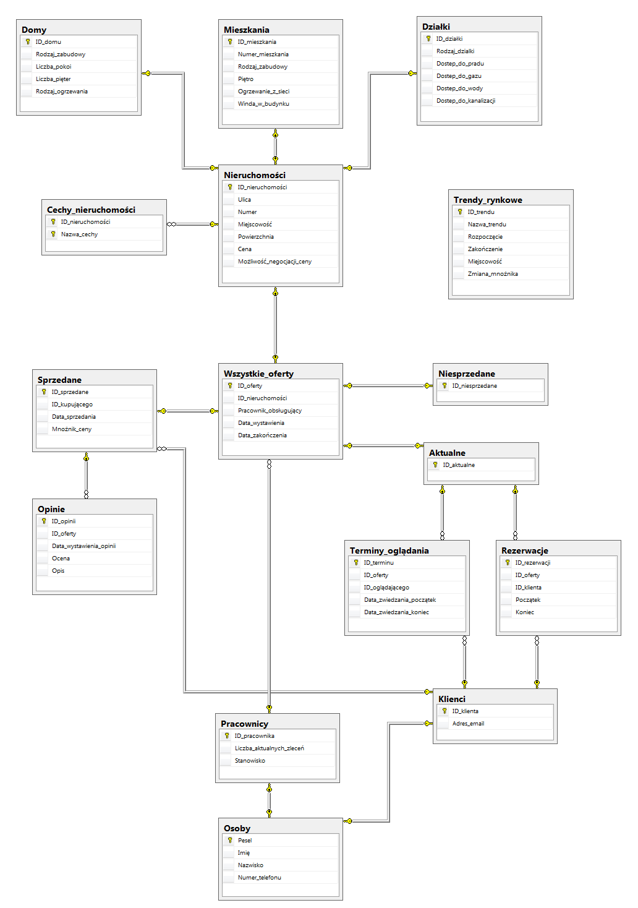
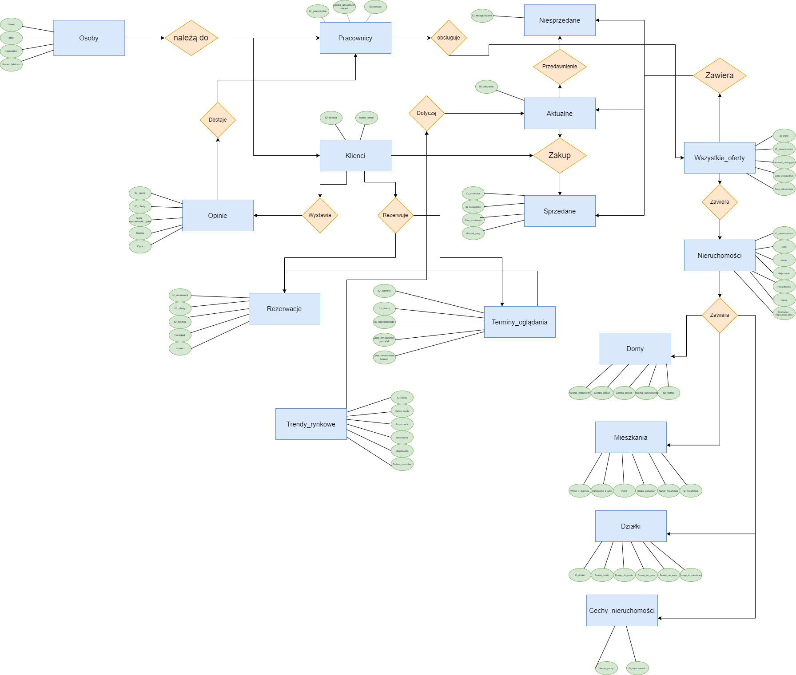
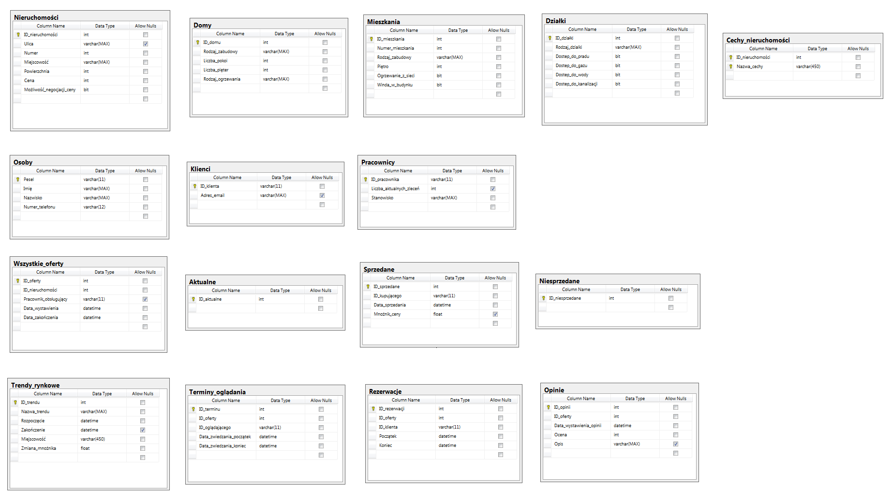

# Baza danych firmy pośredniczącej w sprzedaży nieruchomości
Autorzy: Jakub Magiera, Konrad Sitek

# Założenia projektu
Projekt dotyczył stworzenia bazy danych dla firmy pośredniczącej w sprzedaży nieruchomości. Celem projektu było stworzenie skutecznego narzędzia do zarządzania ofertami nieruchomości oraz udostępnianie ich klientom.

Baza danych zawiera informacje o ofertach nieruchomości, takie jak typ nieruchomości, lokalizacja, cena itp. oraz pozwala zarządzać nimi: dodawać nowe oferty, grupować je według status (aktualne / sprzedane / niesprzedane), publikować opinie oraz śledzić pracę pracowników. Baza danych umożliwia również automatyczne modyfikowanie cen istniejących ofert, zgodnie z tym co obecnie dzieje się na rynku (trendy).

Na potrzeby projektu ograniczyliśmy się do trzech typów nieruchomośći: domy, mieszkania oraz działki.

# Schemat pielęgnacji bazy danych
Strategia pielęgnacji bazy danych może obejmować następujące kroki:

1. Regularne aktualizacje danych - sprawdzanie czy są one nadal aktualne (w przypadkach, których baza automatycznie nie obsłuży).

2. Usuwanie duplikatów i nieaktualnych danych - usuwanie duplikatów i informacji, które już nie są aktualne, aby zachować czystość i przejrzystość bazy danych oraz zapewnić jej bezbłędne działanie.

3. Backup bazy danych - tworzenie regularnych kopii zapasowych, aby uniknąć utraty danych w razie awarii systemu. Przewdiujemy łączyć backup lokalny oraz zdalny. Codziennie o określonej porze następowałaby migracja danych na zewnętrzny serwis (do chmury). Raz na tydzień lub dwa (w zależności od zmian w bazie, liczbie działań) wykonywany byłby backup lokalny na dyski twarde przechowywane w bezpiecznym miejscu w siedzibie firmy. 

4. Ochrona danych - zabezpieczenie bazy przed nieautoryzowanym dostępem i modyfikacją.

5. Analiza danych - regularna analiza danych z bazy, aby zidentyfikować możliwe ulepszenia i poprawić efektywność działania firmy.

# Diagram ER
Na diagramie znajduję sie graficzna reprezentacja zależności pomiędzy tabelami w bazie.




# Schemat bazy danych


# Tabele
- Nieruchomości
    - Domy
    - Mieszkania
    - Działki
- Osoby
    - Klienci
    - Pracownicy
- Cechy nieruchomości
- Wszystkie oferty
    - Aktualne
    - Sprzedane
    - Niesprzedane
- Trendy rynkowe
- Terminy oglądania
- Rezerwacje
- Opinie

# Dodatkowe więzy nieuwzględnione w schemacie
- Nieruchomości:
    - Numer >= 0,
    - Powierzchnia > 0,
    - Cena > 0.
- Domy:
    - Liczba_pokoi > 0,
    - Liczba_pięter >= 0.
- Mieszkania:
    - Numer_mieszkania >= 0.
- Pracownicy:
    - Liczba_aktualnych_zleceń >= 0.
- Wszystkie oferty:
    - Data_wystawienia < Data_zakończenia.
- Sprzedane:
    - Mnożnik_ceny > 0
- Terminy oglądania:
    - Data_zwiedzania_początek < Data_zwiedzania_koniec .
- Trendy rynkowe:
    - Rozpoczęcie < Zakończenie,
    - Zmiana_Mnożnika > 0 AND Zmiana_Mnożnika <= 1.
- Rezerwacje:
    - Początek < Koniec.
- Opinie
    - Ocena >= 0 && Ocena <= 10.

# Widoki
Ranking pracowników na podstawie ocen klientów (pod uwagę brani są tylko pracownicy z co najmniej jedną oceną)
```tsql
CREATE VIEW Ranking_pracowników AS
	SELECT Os.Imię, Os.Nazwisko, P.ID_pracownika, AVG(O.Ocena) AS Średnia_ocena FROM Opinie O
	INNER JOIN Wszystkie_oferty W ON W.ID_oferty = O.ID_Oferty
	INNER JOIN Pracownicy P ON W.Pracownik_obsługujący = P.ID_pracownika
	INNER JOIN Osoby Os ON Os.Pesel = P.ID_pracownika
	GROUP BY P.ID_pracownika,Os.Imię, Os.Nazwisko
GO
```

Liczba ofert wystawionych w danym miesiącu
```tsql
CREATE VIEW Liczba_ofert_w_miesiącu AS
	SELECT MONTH(Data_wystawienia) AS [Numer miesiąca], COUNT(MONTH(Data_wystawienia)) AS [Liczba ofert w miesiącu] FROM Wszystkie_oferty
	GROUP BY MONTH(Data_wystawienia)
GO
```

Suma wartości nieruchomości w poszczególnych miejscowościach
```tsql
CREATE VIEW Suma_wartości AS
	SELECT Miejscowość, SUM(Cena) AS [Suma nieruchmości] FROM Nieruchomości
	GROUP BY Miejscowość
GO
```

Liczba obecnie zarezerwowanych terminów oglądania pracownika
```tsql
CREATE VIEW Liczba_terminów_pracowników AS
	SELECT O.Imię, O.Nazwisko, O.Numer_telefonu , COUNT(Id_terminu) AS [Liczba zarezerwowanych terminów] FROM Osoby O
	INNER JOIN Pracownicy P ON
	O.Pesel = P.Id_pracownika
	LEFT JOIN Wszystkie_oferty W ON
	W.Pracownik_obsługujący = P.ID_pracownika
	INNER JOIN Terminy_oglądania T ON
	W.ID_oferty = T.ID_oferty
	GROUP BY O.Imię, O.Nazwisko, O.Numer_telefonu
GO
```

Obrót pracowników - suma wartości sprzedanych przez nich nieruchomości
```tsql
CREATE VIEW Obrót_pracowników AS
	SELECT Osoby.Imię, Osoby.Nazwisko, SUM(Nieruchomości.Cena) AS [Suma sprzedanych nieruchomości] FROM Pracownicy 
	LEFT JOIN Osoby ON Pracownicy.ID_pracownika = Osoby.Pesel
	LEFT JOIN Wszystkie_oferty ON Pracownicy.ID_pracownika = Wszystkie_oferty.Pracownik_obsługujący
	LEFT JOIN Nieruchomości ON Wszystkie_oferty.ID_nieruchomości = Nieruchomości.ID_nieruchomości
	LEFT JOIN Sprzedane ON Sprzedane.ID_sprzedane = Wszystkie_oferty.ID_nieruchomości
	GROUP BY Osoby.Imię, Osoby.Nazwisko
GO
```

Aktualne oferty danego pracownika
```tsql
CREATE VIEW Pracownik_aktualne AS
	SELECT O.Pesel, COUNT(A.ID_aktualne) AS [Ilosc aktualnych] FROM Osoby O
	INNER JOIN Wszystkie_oferty W ON
	W.Pracownik_obsługujący = O.Pesel
	LEFT JOIN
	Aktualne A ON
	W.ID_oferty = A.ID_aktualne
    GROUP BY O.Pesel
GO
```

Sprzedane nieruchomości danego pracownika
```tsql
CREATE VIEW Pracownik_sprzedane AS
	SELECT O.Pesel, COUNT(S.ID_sprzedane) AS [Ilosc sprzedanych] FROM Osoby O
	INNER JOIN Wszystkie_oferty W ON
	W.Pracownik_obsługujący = O.Pesel
	LEFT JOIN
	Sprzedane S ON
	W.ID_oferty = S.ID_sprzedane
    GROUP BY O.Pesel
GO
```

Niesprzedane nieruchomości danego pracownika
```tsql
CREATE VIEW Pracownik_niesprzedane AS
	SELECT O.Pesel, COUNT(N.ID_niesprzedane) AS [Ilosc niesprzedanych] FROM Osoby O
	INNER JOIN Wszystkie_oferty W ON
	W.Pracownik_obsługujący = O.Pesel
	LEFT JOIN
	Niesprzedane N ON
	W.ID_oferty = N.ID_niesprzedane
    GROUP BY O.Pesel
GO
```

Statystyki pracowników - liczby aktualnych, sprzedanych i niesprzedanych ofert
```tsql
CREATE VIEW Pracownik_statystyki AS
	SELECT O.Imię, O.Nazwisko, O.Numer_telefonu, Pa.[Ilosc aktualnych], Ps.[Ilosc sprzedanych], Pn.[Ilosc niesprzedanych] FROM Osoby O 
	INNER JOIN Pracownik_aktualne Pa ON
	Pa.Pesel = O.Pesel
	INNER JOIN Pracownik_sprzedane Ps ON
	Ps.Pesel = O.Pesel
	INNER JOIN Pracownik_niesprzedane Pn ON
	Pn.Pesel = O.Pesel
GO
```

# Funkcje
Nieruchomości znajdujące się w danym mieście
```tsql
CREATE FUNCTION Aktualne_z_miasta(@x VARCHAR(MAX))
RETURNS TABLE
AS
RETURN
    SELECT * FROM Nieruchomości N
	LEFT JOIN Aktualne A ON	N.ID_nieruchomości = A.ID_aktualne
	WHERE N.Miejscowość = @x;
GO
```

Nieruchomości danego typu
```tsql
CREATE FUNCTION Oferty_typu(@x VARCHAR(MAX))
RETURNS @result TABLE (ID_nieruchomosci int, Ulica VARCHAR(MAX), Numer int,Miejscowość VARCHAR(MAX),Powierzchnia INT,Cena INT, Możliwość_negocjacji_ceny BIT)
AS
BEGIN
	IF @x = 'Domy' BEGIN
		INSERT INTO @result
		SELECT N.ID_nieruchomości, N.Ulica, N.Numer, N.Miejscowość, N.Powierzchnia, N.Cena, N.Możliwość_negocjacji_ceny FROM Domy
		LEFT JOIN Nieruchomości N ON
		ID_domu = N.ID_nieruchomości
	END
	ELSE IF @x = 'Działki' BEGIN
		INSERT INTO @result
		SELECT N.ID_nieruchomości, N.Ulica, N.Numer, N.Miejscowość, N.Powierzchnia, N.Cena, N.Możliwość_negocjacji_ceny FROM Działki
		LEFT JOIN Nieruchomości N ON
		ID_działki = N.ID_nieruchomości
	END
	ELSE IF @x = 'Mieszkania' BEGIN
		INSERT INTO @result
		SELECT N.ID_nieruchomości, N.Ulica, N.Numer, N.Miejscowość, N.Powierzchnia, N.Cena, N.Możliwość_negocjacji_ceny FROM Mieszkania
		LEFT JOIN Nieruchomości N ON ID_mieszkania = N.ID_nieruchomości
	END
	ELSE BEGIN
		INSERT INTO @result SELECT NULL, NULL, NULL, NULL, NULL, NULL, NULL
	END
	RETURN
END
GO
```

Oferty w danym przedziale cenowym
```tsql
CREATE FUNCTION Oferty_od_do(@a INT, @b INT)
RETURNS TABLE
AS
RETURN
	SELECT * FROM Nieruchomości WHERE Nieruchomości.Cena >= @a AND Nieruchomości.Cena <= @b;
GO
```

Wyswietlenie wszystkich informacji odnośnie nieruchomości z danej oferty 
```tsql
CREATE FUNCTION Info_oferta(@x INT)
RETURNS TABLE
AS
RETURN 
	SELECT 
	W.Pracownik_obsługujący, W.Data_wystawienia, W.Data_zakończenia, N.Ulica, N.Numer,N.Miejscowość,N.Powierzchnia, N.Cena,N.Możliwość_negocjacji_ceny FROM Wszystkie_oferty W INNER JOIN
	Nieruchomości N ON
	W.ID_nieruchomości = N.ID_nieruchomości
	WHERE W.ID_nieruchomości = @x
GO
```

# Procedury składowane
W przypadku procedur, w których parametrem jest ID klienta zakładamy, że zostałoby przekazane przez klienta, który by je pobrał od aktualnie zalogowanego użytkownika.

Poniższa procedura synchronizuje wszystkie tabele w bazie, których zawartość jest zależna od czasu. W prawdziwej bazie, data byłaby sprawdzana automatycznie w każdym momencie. Na potrzeby naszego projektu istnieje procedura.
```tsql
CREATE PROCEDURE Synchronizuj
AS
    SET NOCOUNT ON

    --dodanie do aktualnych oferty tych, które jeszcze się nie przedawniły, nie zostały sprzedana oraz nie są już w aktualnych
    INSERT INTO Aktualne SELECT ID_oferty FROM Wszystkie_oferty WHERE ID_oferty NOT IN (SELECT ID_aktualne FROM Aktualne) AND ID_oferty NOT IN (SELECT ID_sprzedane FROM Sprzedane) AND Data_zakończenia > GETDATE()

    --dodanie do niesprzedanych ofert tych, które przedawniły się i nie są one już w niesprzedanych lub w sprzedancyh
    INSERT INTO Niesprzedane SELECT ID_oferty FROM Wszystkie_oferty WHERE ID_oferty NOT IN (SELECT ID_niesprzedane FROM Niesprzedane) AND ID_oferty NOT IN (SELECT ID_sprzedane FROM Sprzedane) AND Data_zakończenia <= GETDATE()

    --usunięcie przedawnionych ofert z aktualnych
    DELETE FROM Aktualne WHERE ID_aktualne IN (SELECT ID_niesprzedane FROM Niesprzedane)

    --usuniecie przedawnionej rezerwacji
    DELETE FROM Rezerwacje WHERE Koniec <= GETDATE()

    --usuniecie przedawnionego trendu
    DELETE FROM Trendy_rynkowe WHERE Zakończenie IS NOT NULL AND Zakończenie <= GETDATE()

    --usuniecie przedawnionego terminu oglądania
    DELETE FROM Terminy_oglądania WHERE Data_zwiedzania_koniec <= GETDATE()

    PRINT('SUKCES - synchronizacja przebiegła pomyślnie!')
GO
```

Poniższe cztery procedury odpowiadają za dodanie konkretnej nieruchomości do bazy. W interfejsie graficznym wyglądałoby to tak, że po wybraniu typu nieruchomości, pojawiają się kolejne okienka z moliwościa wprowadzenia odpowiednej informacji. W naszym przypadku będziemy przekazywali do procedury odpowiednie informacje, a pozostałe pola wypełnimy NULLami.
```tsql
CREATE PROCEDURE DodajDom (@ID INT, @Type VARCHAR(MAX), @Rooms INT, @Floors INT, @Heating VARCHAR(MAX))
AS
    INSERT INTO Domy VALUES (@ID, @Type, @Rooms, @Floors, @Heating)
    PRINT('SUKCES - dodano ogłoszenie domu!')
    EXEC Synchronizuj
GO
```
```tsql
CREATE PROCEDURE DodajMieszkanie (@ID INT, @Flat_number INT, @Type VARCHAR(MAX), @Floor INT, @Heating BIT, @Lift BIT)
AS
    INSERT INTO Mieszkania VALUES (@ID, @Flat_number, @Type, @Floor, @Heating, @Lift)
    PRINT('SUKCES - dodano ogłoszenie mieszkania!')
    EXEC Synchronizuj
GO
```
```tsql
CREATE PROCEDURE DodajDziałkę (@ID INT, @Type VARCHAR(MAX), @Electricty BIT, @Gas BIT, @Water BIT, @Sewers BIT)
AS
    INSERT INTO Działki VALUES (@ID, @Type, @Electricty, @Gas, @Water, @Sewers)
    PRINT('SUKCES - dodano ogłoszenie działki!')
    EXEC Synchronizuj
GO
```
```tsql
CREATE PROCEDURE DodajNieruchomość (@Type_of_estate VARCHAR(MAX), @Street VARCHAR(MAX), @Number INT, @Place VARCHAR(MAX), @Space INT, @Price INT, @Negotiable BIT, @Type VARCHAR(MAX), @Rooms INT, @Floors INT, @HeatingType VARCHAR(MAX), @Flat_number INT, @Floor INT, @HeatingBit BIT, @Lift BIT, @Electricty BIT, @Gas BIT, @Water BIT, @Sewers BIT) 
AS
    IF @Type_of_estate IS NOT NULL AND @Street IS NOT NULL AND @Number IS NOT NULL AND @Place IS NOT NULL AND @Space IS NOT NULL AND @Price IS NOT NULL AND @Negotiable IS NOT NULL AND @Type IS NOT NULL BEGIN
        IF NOT EXISTS(SELECT ID_nieruchomości FROM Nieruchomości WHERE Ulica = @Street AND Numer = @Number AND Miejscowość = @Place AND Powierzchnia = @Space) AND (@Type_of_estate LIKE 'dom' OR @Type_of_estate LIKE 'działka') BEGIN
            IF @Type_of_estate = 'dom' BEGIN
                IF @Type IS NOT NULL AND @Rooms IS NOT NULL AND @Floors IS NOT NULL AND @HeatingType IS NOT NULL BEGIN
                    INSERT INTO Nieruchomości(Ulica, Numer, Miejscowość, Powierzchnia, Cena, Możliwość_negocjacji_ceny) VALUES (@Street, @Number, @Place, @Space, @Price, @Negotiable)
                    DECLARE @ID INT = (SELECT TOP 1 ID_nieruchomości FROM Nieruchomości ORDER BY ID_nieruchomości DESC)
                    EXEC DodajDom @ID, @Type, @Rooms, @Floors, @HeatingType
                END
                ELSE BEGIN
                    PRINT('BŁĄD - niepełne dane!')
                END
            END
            ELSE IF @Type_of_estate = 'działka' BEGIN
                IF @Type IS NOT NULL AND @Electricty IS NOT NULL AND @Gas IS NOT NULL AND @Water IS NOT NULL AND @Sewers IS NOT NULL BEGIN
                    INSERT INTO Nieruchomości(Ulica, Numer, Miejscowość, Powierzchnia, Cena, Możliwość_negocjacji_ceny) VALUES (@Street, @Number, @Place, @Space, @Price, @Negotiable)
                    DECLARE @ID_2 INT = (SELECT TOP 1 ID_nieruchomości FROM Nieruchomości ORDER BY ID_nieruchomości DESC)
                    EXEC DodajDziałkę @ID_2, @Type, @Electricty, @Gas, @Water, @Sewers
                END
                ELSE BEGIN
                    PRINT('BŁĄD - niepełne dane!')
                END
            END
        END
        ELSE IF @Type_of_estate = 'mieszkanie' AND NOT EXISTS(SELECT * FROM Mieszkania INNER JOIN Nieruchomości ON Mieszkania.ID_mieszkania = Nieruchomości.ID_nieruchomości WHERE Ulica = @Street AND Numer = @Number AND Miejscowość = @Place AND Powierzchnia = @Space AND @Flat_number IS NOT NULL AND Numer_mieszkania = @Flat_number) BEGIN
            IF @Flat_number IS NOT NULL AND @Type IS NOT NULL AND @Floor IS NOT NULL AND @HeatingBit IS NOT NULL AND @Lift IS NOT NULL BEGIN
                INSERT INTO Nieruchomości(Ulica, Numer, Miejscowość, Powierzchnia, Cena, Możliwość_negocjacji_ceny) VALUES (@Street, @Number, @Place, @Space, @Price, @Negotiable)
                DECLARE @ID_3 INT = (SELECT TOP 1 ID_nieruchomości FROM Nieruchomości ORDER BY ID_nieruchomości DESC)
                EXEC DodajMieszkanie @ID_3, @Flat_number, @Type, @Floor, @HeatingBit, @Lift
            END
            ELSE BEGIN
                PRINT('BŁĄD - niepełne dane!')
            END            
        END
        ELSE BEGIN
            PRINT('BŁĄD - w bazie istnieje już ta nieruchomość lub podałeś zły typ nieruchomości!')
        END
    END
    ELSE BEGIN
        PRINT('BŁĄD - niepełne dane!')
    END   
GO
```

Dodanie ogłoszenia - parametry: ID ogłoszenia, data zakończenia ogłoszenia
```tsql
CREATE PROCEDURE DodajOgłoszenie (@EstateID INT, @End DATETIME)
AS
    IF @EstateID IS NULL OR @End IS NULL BEGIN
        PRINT('BŁĄD - niepełne dane!')
    END
    ELSE IF @EstateID IN (SELECT ID_nieruchomości FROM Nieruchomości) BEGIN
        IF @EstateID NOT IN (SELECT ID_aktualne FROM AKTUALNE) BEGIN
            IF GETDATE() < @End BEGIN
                INSERT INTO Wszystkie_oferty(ID_nieruchomości, Data_wystawienia, Data_zakończenia) VALUES (@EstateID, GETDATE(), @End)
                PRINT('SUKCES - pomyślnie dodano ogłoszenie!')
                EXEC Synchronizuj
            END
            ELSE BEGIN
                PRINT('BŁĄD - niewłaściwy przedział czasowy!')
            END
        END
        ELSE BEGIN
            PRINT('BŁĄD - istnieje już aktualne ogłoszenie dla tej nieruchomości!')
        END
    END
    ELSE BEGIN
        PRINT('BŁĄD - nie istnieje nieruchomość o takim ID!')
    END
GO
```

Zakup nieruchomości z danej oferty - parametry: ID ogłoszenia, ID klienta
```tsql
CREATE PROCEDURE ZakupNieruchomości (@OfferID INT, @CustomerID VARCHAR(11))
AS
    IF @OfferID IS NULL OR @CustomerID IS NULL BEGIN
        PRINT('BŁĄD - niepełne dane!')
    END
    ELSE IF (@OfferID IN (SELECT ID_aktualne FROM Aktualne) AND ((@OfferID NOT IN (SELECT ID_oferty FROM Rezerwacje) OR (@OfferID IN (SELECT ID_oferty FROM Rezerwacje WHERE ID_klienta LIKE @CustomerID))))) BEGIN
        DECLARE @place VARCHAR(MAX) = (SELECT Miejscowość FROM Wszystkie_oferty INNER JOIN Nieruchomości ON  Wszystkie_oferty.ID_nieruchomości = Nieruchomości.ID_nieruchomości WHERE ID_oferty = @OfferID)

        DECLARE @multiplier FLOAT = (SELECT Zmiana_mnożnika FROM Trendy_rynkowe WHERE Miejscowość LIKE @place AND Rozpoczęcie <= GETDATE() AND Zakończenie > GETDATE())

        IF @multiplier IS NULL BEGIN
            SET @multiplier = 1
        END

        DECLARE @EstateID INT = (SELECT ID_nieruchomości FROM Wszystkie_oferty WHERE ID_nieruchomości = @OfferID)

        INSERT INTO Sprzedane VALUES (@EstateID, @CustomerID, GETDATE(), @multiplier)
        DELETE FROM Aktualne WHERE ID_aktualne = @OfferID

        PRINT('SUKCES - udało Ci się zakupić tą nieruchmość!')

        EXEC Synchronizuj
    END
    ELSE BEGIN
        PRINT('BŁĄD - nieruchomość o podanym ID nie istenieje lub nie jest obecnie dostępna!')
    END  
GO
```

Rezerwacja nieruchomości - parametry: ID ogłoszenia, ID klienta, data zakończenia rezerwacji
```tsql
CREATE PROCEDURE Rezerwacja (@OfferID INT, @CustomerID VARCHAR(11), @End DATETIME)
AS
    IF @OfferID IS NULL OR @CustomerID IS NULL OR @End IS NULL BEGIN
        PRINT('BŁĄD - niepełne dane!')
    END
    ELSE IF @OfferID IN (SELECT ID_oferty FROM Wszystkie_oferty) BEGIN
        DECLARE @EstateID INT = (SELECT ID_nieruchomości FROM Wszystkie_oferty WHERE ID_oferty = @OfferID)

        IF @OfferID IN (SELECT ID_aktualne FROM Aktualne) BEGIN
            IF GETDATE() < @End AND GETDATE() < (SELECT Data_zakończenia FROM Wszystkie_oferty WHERE ID_oferty = @OfferID) AND @End < (SELECT Data_zakończenia FROM Wszystkie_oferty WHERE ID_oferty = @OfferID) BEGIN 
                IF NOT EXISTS(SELECT ID_rezerwacji FROM Rezerwacje WHERE ID_oferty = @OfferID AND Początek <= GETDATE() AND Koniec > GETDATE()) BEGIN
                    INSERT INTO Rezerwacje(ID_oferty, ID_klienta, Początek, Koniec) VALUES (@OfferID, @CustomerID, GETDATE(), @End)
                    PRINT('SUKCES - pomyślnie dodano rezerwację!')
                    EXEC Synchronizuj
                END
                ELSE BEGIN
                    PRINT('BŁĄD - ta nieruchomość jest obecnie zarezerwowana!')
                END
            END
            ELSE BEGIN
                PRINT('BŁĄD - niewłaściwy przedział czasowy!')
            END
        END
        ELSE BEGIN
            PRINT('BŁĄD - to ogłosznie nie jest już aktualne!')
        END
    END
    ELSE BEGIN
        PRINT('BŁĄD - nie istnieje ogłoszenie o takim ID!')
    END
GO
```

Dodanie opinii - parametry: ID klienta, ID ogłoszenia, ocena, opis
```tsql
CREATE PROCEDURE DodajOpinię (@CustomerID VARCHAR(11), @OfferID INT, @Grade INT, @Description VARCHAR(MAX))
AS
    IF @CustomerID IS NULL OR @OfferID IS NULL OR @Grade IS NULL OR @Description IS NULL BEGIN
        PRINT('BŁĄD - niepełne dane!')
    END
    ELSE IF @Grade < 1 OR @Grade > 10 BEGIN
    	PRINT('BŁĄD - ocena musi być z przedziału 1 - 10!')
 	END
    ELSE IF @OfferID IN (SELECT ID_sprzedane FROM Sprzedane WHERE ID_kupującego = @CustomerID) BEGIN
        IF (@OfferID NOT IN (SELECT ID_oferty FROM Opinie)) BEGIN
            INSERT INTO Opinie(ID_oferty, Data_wystawienia_opinii, Ocena, Opis) VALUES (@OfferID, GETDATE(), @Grade, @Description)
            PRINT('SUKCES - pomyślnie dodano opinię!')

            EXEC Synchronizuj
        END
        ELSE BEGIN
            PRINT('BŁĄD - zamieściłeś już opinię odnośnie tej nieruchomości!')
        END
    END
    ELSE BEGIN
        PRINT('BŁĄD - klient o podanym ID nie istnieje, nie zakupił żadnej nieruchomości lub tej o podanym ID!')
    END
GO
```

Rezerwacja terminu oglądania - ID klienta, ID ogłoszenia, początek terminu oglądania, koniec terminu oglądania
```tsql
CREATE PROCEDURE ZarezerwujTerminOglądania (@CustomerID VARCHAR(11), @OfferID INT, @Start DATETIME, @End DATETIME)
AS
    IF @CustomerID IS NULL OR @OfferID IS NULL OR @Start IS NULL OR @End IS NULL BEGIN
        PRINT('BŁĄD - niepełne dane!')
    END
    ELSE IF @OfferID IN (SELECT ID_aktualne FROM Aktualne) BEGIN
        IF @Start < @End AND @Start >= GETDATE() AND @End > GETDATE() AND @Start < (SELECT Data_zakończenia FROM Wszystkie_oferty WHERE ID_oferty = @OfferID) AND @End < (SELECT Data_zakończenia FROM Wszystkie_oferty WHERE ID_oferty = @OfferID) BEGIN
            DECLARE @employee VARCHAR(11) = (SELECT Pracownik_obsługujący FROM Wszystkie_oferty WHERE ID_oferty = @OfferID)

            IF @employee NOT IN (SELECT Pracownik_obsługujący FROM Terminy_oglądania INNER JOIN Wszystkie_oferty ON Terminy_oglądania.ID_oferty = Wszystkie_oferty.ID_oferty WHERE Pracownik_obsługujący LIKE @employee AND (@Start >= Data_zwiedzania_początek OR @End > Data_zwiedzania_początek) AND (@Start < Data_zwiedzania_koniec OR @End <= Data_zwiedzania_koniec)) BEGIN
                IF DATEDIFF(SECOND, @Start, @End) >= 600 AND DATEDIFF(SECOND, @Start, @End) <= 7200 BEGIN
                    INSERT INTO Terminy_oglądania(ID_oferty, ID_oglądającego, Data_zwiedzania_początek, Data_zwiedzania_koniec) VALUES (@OfferID, @CustomerID, @Start, @End)
                    PRINT('SUKCES - zarezerwowano termin oglądania')

                    EXEC Synchronizuj
                END
                ELSE BEGIN
                    PRINT('BŁĄD - wizyta musi trwać minimalnie 10 minut, a maksymalnie 2 godziny!')
                END
            END
            ELSE BEGIN
                PRINT('BŁĄD - pracownik jest zajęty w tym terminie!')
            END
        END
        ELSE BEGIN
            PRINT('BŁĄD - niewłaściwy przedział czasowy lub ogłoszenie w tym czasie może już być nieaktualne!')
        END   
    END
    ELSE BEGIN
        PRINT('BŁĄD - nie istnieje aktualna oferta o podanym ID!')
    END
GO
```

# Wyzwalacze
Dodanie trendu - akualizuje ceny wszystkich ogłoszeń, z których nieruchomości znajdują się w danym mieście
```tsql
CREATE TRIGGER DodanieTrendu
ON Trendy_rynkowe
AFTER INSERT
AS
BEGIN
    DECLARE @loop_border INT = (SELECT MAX(ID_trendu) FROM INSERTED)
    DECLARE @iterator INT = (SELECT MIN(ID_trendu) FROM INSERTED)

    WHILE(@iterator <= @loop_border) BEGIN
        IF EXISTS(SELECT ID_trendu FROM INSERTED WHERE ID_trendu = @iterator) BEGIN
            DECLARE @multiplier FLOAT = (SELECT Zmiana_Mnożnika FROM INSERTED WHERE ID_trendu = @iterator)
            DECLARE @place VARCHAR(MAX) = (SELECT Miejscowość FROM INSERTED WHERE ID_trendu = @iterator)

            IF ((SELECT Nazwa_trendu FROM INSERTED WHERE ID_trendu = @iterator) = 'wzrost')
            BEGIN
                UPDATE Nieruchomości        
                    SET Nieruchomości.Cena = Nieruchomości.Cena * (1 + @multiplier) 
                    WHERE Nieruchomości.Miejscowość = @place AND Nieruchomości.ID_nieruchomości IN (SELECT ID_aktualne FROM Aktualne)
            END

            ELSE IF ((SELECT Nazwa_trendu FROM INSERTED WHERE ID_trendu = @iterator) = 'spadek')
            BEGIN
                UPDATE Nieruchomości
                    SET Nieruchomości.Cena = Nieruchomości.Cena * (1 - @multiplier)
                    WHERE Nieruchomości.Miejscowość = @place AND Nieruchomości.ID_nieruchomości IN (SELECT ID_aktualne FROM Aktualne)
            END
        END

        SET @iterator = @iterator + 1           
    END
END
GO
```

Koniec trendu - przywrócenie pierwotnej ceny po zakończeniu trendu
```tsql
CREATE TRIGGER KoniecTrendu
ON Trendy_rynkowe
AFTER DELETE
AS
BEGIN
    DECLARE @loop_border INT = (SELECT MAX(ID_trendu) FROM DELETED)
    DECLARE @iterator INT = (SELECT MIN(ID_trendu) FROM DELETED)

    WHILE(@iterator <= @loop_border) BEGIN
        IF EXISTS(SELECT ID_trendu FROM DELETED WHERE ID_trendu = @iterator) BEGIN
            DECLARE @multiplier FLOAT = (SELECT Zmiana_Mnożnika FROM DELETED WHERE ID_trendu = @iterator)
            DECLARE @place VARCHAR(MAX) = (SELECT Miejscowość FROM DELETED WHERE ID_trendu = @iterator)

            IF ((SELECT Nazwa_trendu FROM DELETED WHERE ID_trendu = @iterator) = 'wzrost')
            BEGIN
                UPDATE Nieruchomości        
                    SET Nieruchomości.Cena = Nieruchomości.Cena * 100 / (1 + @multiplier) 
                    WHERE Nieruchomości.Miejscowość = @place AND Nieruchomości.ID_nieruchomości IN (SELECT ID_aktualne FROM Aktualne)
            END

            ELSE IF ((SELECT Nazwa_trendu FROM DELETED WHERE ID_trendu = @iterator) = 'spadek')
            BEGIN
                UPDATE Nieruchomości
                    SET Nieruchomości.Cena = Nieruchomości.Cena * 100 / (1 - @multiplier)
                    WHERE Nieruchomości.Miejscowość = @place AND Nieruchomości.ID_nieruchomości IN (SELECT ID_aktualne FROM Aktualne)
            END
        END

        SET @iterator = @iterator + 1           
    END
END
GO
```

Przydzielenie pracownika - przydzielenie pracownika o najmniejszej ilości aktualnych ogłoszeń do nowego ogłoszenia
```tsql
CREATE TRIGGER PrzydzieleniePracownika
ON Aktualne
AFTER INSERT
AS
BEGIN
    DECLARE @loop_border INT = (SELECT MAX(ID_aktualne) FROM INSERTED)
    DECLARE @iterator INT = (SELECT MIN(ID_aktualne) FROM INSERTED)

    WHILE(@iterator <= @loop_border) BEGIN
        IF EXISTS(SELECT ID_aktualne FROM INSERTED WHERE ID_aktualne = @iterator) BEGIN
            DECLARE @employee VARCHAR(11) = (SELECT TOP 1 ID_pracownika FROM Pracownicy ORDER BY Liczba_aktualnych_zleceń ASC)

            UPDATE Pracownicy
                SET Liczba_aktualnych_zleceń = Liczba_aktualnych_zleceń + 1
                WHERE ID_pracownika = @employee

            UPDATE Wszystkie_oferty
                SET Pracownik_obsługujący = @employee
                WHERE ID_oferty = @iterator
        END

        SET @iterator = @iterator + 1           
    END
END
GO
```

Zwolnienie pracownika sprzedane - usunięcie z licznika aktulnych ogłoszeń sprzedanego ogłoszenia
```tsql
CREATE TRIGGER ZwolnieniePracownikaSprzedane
ON Sprzedane
AFTER INSERT
AS
BEGIN
    DECLARE @loop_border INT = (SELECT MAX(ID_sprzedane) FROM INSERTED)
    DECLARE @iterator INT = (SELECT MIN(ID_sprzedane) FROM INSERTED)

    WHILE(@iterator <= @loop_border) BEGIN
        IF EXISTS(SELECT ID_sprzedane FROM INSERTED WHERE ID_sprzedane = @iterator) BEGIN
            DECLARE @employee VARCHAR(11) = (SELECT Pracownik_obsługujący FROM INSERTED INNER JOIN Wszystkie_oferty ON INSERTED.ID_sprzedane = Wszystkie_oferty.ID_oferty WHERE INSERTED.ID_sprzedane = @iterator)

            UPDATE Pracownicy
                SET Liczba_aktualnych_zleceń = Liczba_aktualnych_zleceń - 1
                WHERE ID_pracownika = @employee
        END

        SET @iterator = @iterator + 1           
    END
END
GO
```

Zwolnienie pracownika niesprzedane - usunięcie z licznika aktulnych ogłoszeń niesprzedanego ogłoszenia
```tsql
CREATE TRIGGER ZwolnieniePracownikaNiesprzedane
ON Niesprzedane
AFTER INSERT
AS
BEGIN
    DECLARE @loop_border INT = (SELECT MAX(ID_niesprzedane) FROM INSERTED)
    DECLARE @iterator INT = (SELECT MIN(ID_niesprzedane) FROM INSERTED)

    WHILE(@iterator <= @loop_border) BEGIN
        IF EXISTS(SELECT ID_niesprzedane FROM INSERTED WHERE ID_niesprzedane = @iterator) BEGIN
            DECLARE @employee VARCHAR(11) = (SELECT Pracownik_obsługujący FROM INSERTED INNER JOIN Wszystkie_oferty ON INSERTED.ID_niesprzedane = Wszystkie_oferty.ID_oferty WHERE INSERTED.ID_niesprzedane = @iterator)

            UPDATE Pracownicy
                SET Liczba_aktualnych_zleceń = Liczba_aktualnych_zleceń - 1
                WHERE ID_pracownika = @employee
        END

        SET @iterator = @iterator + 1           
    END
END
GO
```

# Przykładowe zapytania

Dodawanie nieruchomości
```tsql
--dodanie domu
EXEC DodajNieruchomość 'dom','Sosnowa', 31 , 'Częstochowa', 312,1104001, 1 , 'wolnostojący' , 15 , 2 , 'gaz', NULL , NULL , NULL , NULL , NULL, NULL, NULL,NULL

--dodanie mieszkania
EXEC DodajNieruchomość 'mieszkanie','Aleja Kijowska', 37 , 'Kraków', 61,542000, 0 , 'apartament' , NULL , NULL , NULL, 2 , 1 , 1 , 1 , NULL, NULL, NULL,NULL

--dodanie mieszkania w tym samym budnyku, lecz z innym numerem
EXEC DodajNieruchomość 'mieszkanie','Aleja Kijowska', 37 , 'Kraków', 80,420000, 0 , 'apartament' , NULL , NULL , NULL, 3 , 1 , 1 , 1 , NULL, NULL, NULL,NULL

--dodanie działki
EXEC DodajNieruchomość 'działka','Słoneczna', 68 , 'Kraków',100000 ,530123, 0 , 'budowlana' , NULL , NULL , NULL, NULL , NULL , NULL , NULL , 1, 1,1,1

--BŁĄD - dodanie nieruchomości o niewłaściwym typie
EXEC DodajNieruchomość 'chalupa','Aleja Kijowska', 37 , 'Kraków', 61,542000, 0 , 'apartament' , NULL , NULL , NULL, NULL , 1 , 1 , 1 , NULL, NULL, NULL,NULL

--BŁAD - dodanie nieruchomości z brakującymi parameterami
EXEC DodajNieruchomość 'mieszkanie','Aleja Kijowska', 37 , 'Kraków', 61,542000, 0 , 'apartament' , NULL , NULL , NULL, NULL , 1 , 1 , 1 , NULL, NULL, NULL,NULL
```

Dodawanie ogłoszeń:
```tsql
EXEC DodajOgłoszenie 52, '2023-05-01'
EXEC DodajOgłoszenie 53, '2024-01-02'
EXEC DodajOgłoszenie 54,'2023-02-01'

--BŁĄD - dodanie ogłoszenia nieruchomości, której ogłoszenie już istnieje
EXEC DodajOgłoszenie 54,'2024-02-01'

--BŁĄD - dodanie ogłoszenia dla nieistniejącej nieruchomości
EXEC DodajOgłoszenie 55,'2023-02-01'
```

Zakup nieruchomości:
```tsql
--zakup nieruchomości
EXEC ZakupNieruchomości 2, '31072069990'

--BŁĄD - zakup nieruchomości, która już jest sprzedana
EXEC ZakupNieruchomości 45,'24102948963'
```

Dodawanie opinii:
```tsql
--dodanie opinii
EXEC DodajOpinię '22110855460',18, 10 ,'Wszystko super!'

--BŁAD - dodanie opinii z niewłaściwią oceną
EXEC DodajOpinię '22110855460',18, 11 ,'Zbyt wysoka ocena'

--BŁĄD - dodanie opinii do ogłoszenia, dla którego klient zamieścił już opinię
EXEC DodajOpinię '22110855460',18, 10 ,'Dodanie opini jeszcze raz'
```

Rezerwowanie terminu oglądania:
```tsql
--rezerwacja terminu oglądania
EXEC ZarezerwujTerminOglądania '08230862902', 51,  '2023-03-01 16:00:30', '2023-03-01 17:00:00'

--BŁĄD - rezerwacja terminu kiedy pracownik obsługujący nieruchomość jest już zajęty
EXEC ZarezerwujTerminOglądania '20082281942', 51,  '2023-03-01 16:50:30', '2023-03-01 18:00:00'

--BŁĄD - rezerwacja, która trwa za długo
EXEC ZarezerwujTerminOglądania '86072900736', 20,  '2023-03-01 12:00:00', '2023-03-02 18:00:00'

--BŁAD - rezerwacja nie mieści się w ramach czasowych
EXEC ZarezerwujTerminOglądania '08230862902', 3,  '2024-03-01 12:00:00', '2024-03-01 13:00:00'

--BŁĄD - rezerwacja nieistniejącego ogłoszenia
EXEC ZarezerwujTerminOglądania '20082281942',1000,'2023-05-01 15:00', '2023-05-01 16:00'

--BŁĄD - rezerwacja ogłoszenia, które nie jest w tym czasie aktualne
EXEC ZarezerwujTerminOglądania '20082281942',20,'2022-05-01 15:00', '2022-05-01 16:00'
```

Rezerwowanie nieruchomości:
```tsql
--rezerwacja nieruchomości
EXEC Rezerwacja 1,'40071541277','2023-05-01' 

--BŁĄD - rezerwacja zarezerwowanej już nieruchomości
EXEC Rezerwacja 1,'31072069990','2023-05-02' 

--BŁĄD - rezerwacja z niepoprawnym przedziałem czasowym
EXEC Rezerwacja 1,'35020376651','2027-05-02' 

--BŁĄD - rezerwacja sprzedanej nieruchomości
EXEC Rezerwacja 5,'31072069990','2023-04-10'

--BŁĄD - zakup nieruchomości zarezerwowanej przez innego klienta
EXEC ZakupNieruchomości 1,'31072069990'

--zakup nieruchomości zarezerwowanej przez klienta
EXEC ZakupNieruchomości 1,'40071541277'
```

Gui(HTML,CSS,PHP) posiada trzy etapy

Logowanie do konta klienta lub pracownika


Wybór funkcji(Osobne dla klienta oraz pracownika)


Na ostatnim etapie należy wypełnić pola potrzebne do wykonania funkcji, procedury lub widoku.
Po naciśnięciu wyślij w polu textowym pojawi się wynik zapytania kwerendy.


# [Skrypt tworzący bazę danych](create_database.sql)
